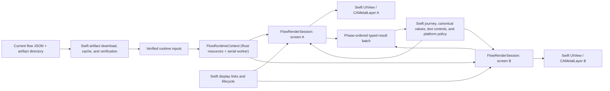

# Nuxie Apple Flow Runtime — Product Definition and Migration Plan

Status: agreed product and architecture definition
Decision date: 2026-07-18
Initial migration input: current server-delivered `.riv` artifact and JSON
contracts, unchanged
Later product direction: a separately designed `.nux` superset

## Decision

Replace `rive-ios` and its linked C++ Rive runtime in `nuxie-ios` with an
internal Apple host for `nuxie-runtime`.

The result is not a general animation SDK and is not source- or API-compatible
with `rive-ios`. It is a specialized runtime for trusted, server-delivered
Nuxie flow UIs. It preserves the two existing Nuxie presentation entry points
and the observable behavior of every currently deliverable flow while keeping
all renderer/runtime types internal.

The migration is a hard cutover. There are no current external SDK consumers,
so there is no production fallback, dual-engine release, rollback branch, or
mid-flow engine switch. Rive may remain temporarily in development and CI as a
reference oracle; after acceptance it is removed from the customer SDK.

## Product outcome

After the migration:

- `NuxieSDK.showFlow(...)` and `getFlowViewController(...)` continue to be the
  only public flow-rendering APIs.
- Existing server artifacts load without republishing or changing publisher,
  manifest, cache, network, or journey contracts.
- Rust imports the verified `.riv` bytes, executes the authored runtime and
  Luau, owns typed runtime state, and renders directly into an Apple GPU
  surface with the `wgpu` Metal backend.
- Swift owns UIKit presentation, the `CAMetalLayer`, frame timing, lifecycle,
  native text controls, canonical journey/response state, and all platform
  effects.
- Customer builds consume an exactly pinned, checksummed XCFramework. They do
  not run Cargo or require a Rust toolchain or Swift build plugin.
- The package continues to support iOS 15 for flow rendering and macOS 12 for
  its existing non-rendering behavior.
- `rive-ios` and the C++ Rive runtime are absent from the linked and packaged
  customer SDK.

## Goals

1. Preserve current flow behavior, layout, typography, interaction, script,
   event-order, transition, and lifecycle semantics.
2. Turn the already mature Rust runtime and renderer into a production Apple
   runtime through a narrow, versioned C ABI.
3. Integrate Nuxie's artifact trust model directly instead of mapping it onto
   Rive's `allowsUnverifiedScripts` escape hatch.
4. Retain Nuxie-owned orchestration and UIKit integrations that do not belong
   in a graphics/runtime engine.
5. Establish measurable device, performance, memory, binary-size, isolation,
   and compatibility gates before deleting Rive.
6. Keep runtime import independent of the current directory/JSON layout so a
   later `.nux` container can produce the same verified runtime inputs.

## Non-goals

- Recreating Rive's public animation-player, authoring, state-machine-input,
  data-binding-wrapper, SwiftUI, AppKit, audio, or generalized fit/alignment
  APIs.
- Supporting arbitrary future Rive file/runtime features. The current
  publisher/runtime format freezes until `.nux` or an explicit compatibility
  project changes it.
- Changing publisher schemas, server wire payloads, artifact layout, manifest
  formats, or delivery semantics in the initial migration. Signing
  provisioning and publisher build/deployment repairs are allowed prerequisites.
- Designing the `.nux` package format in this project.
- Moving journey orchestration, persisted responses, cross-screen canonical
  values, networking, cache policy, or platform effects into Rust.
- Allowing host apps to install Luau modules, replace trust roots, or opt into
  unverified scripts.
- Implementing runtime-native text editing or a new remote accessibility
  semantic tree.
- Adding audio or macOS flow rendering.

## What is being brought over from `rive-ios`

The migration ports behaviors, not Rive's product surface.

| Capability supplied by the Apple SDK today | Decision |
| --- | --- |
| Byte import, runtime object ownership, import errors | Rebuild behind opaque Rust handles and structured results. |
| Default artboard/player resolution | Preserve the used fallback chain internally. |
| Metal presentation and drawable lifecycle | Swift configures the owned `CAMetalLayer` with Rust's retained Metal device and acquires one bounded drawable; Rust wraps that drawable only for the synchronous worker operation, then encodes, submits, and presents it through `wgpu`/Metal. A one-shot command-buffer completion releases the drawable budget and records asynchronous Metal failures for the next render result. |
| Display-link timing, settled pausing, resize and visibility redraw | Keep in a smaller main-actor Swift host, using Rive's proven timing/lifecycle patterns. |
| Bounded background render-command execution | Adapt to one serial worker per loaded artifact and a small Nuxie operation set. |
| Fit/alignment and coordinate conversion | Implement only `.contain` plus centered alignment and its exact inverse. |
| UIKit pointer translation, IDs, cancel/exit, rapid zero-delta flush | Preserve exactly through the coarse session input protocol. |
| State-machine advance and reported-event conversion | Implement as ordered typed Rust output; retain Swift policy for effects. |
| Typed ViewModel discovery, instances, lists, triggers and listeners | Implement as a product-shaped batch interface, not a Swift class per Rive type. |
| Image/font loading and runtime decoding | Swift verifies/resolves bytes; Rust decodes/uploads; Swift also registers fonts with CoreText. |
| Named text-run mutation and runtime geometry | Expose through the session for the retained UIKit text overlay. |
| Luau host modules | Implement the allowlisted `Nuxie` module in Rust with queued typed commands. |
| UIKit native text controls and Apple lifecycle integration | Keep and adapt in `nuxie-ios`. |
| Privacy manifest and binary packaging | Preserve declarations and replace the Rive binary with a pinned Nuxie XCFramework. |

Rive conveniences unrelated to Nuxie flow delivery are intentionally omitted.
The complete decomposition and source evidence are in
[`rive-apple-capabilities.md`](rive-apple-capabilities.md).

## Target architecture

### Repository ownership and cross-language seam

`nuxie-runtime` owns:

- the complete runtime and retained renderer;
- the surface-aware `wgpu` Metal path;
- trusted import inputs and script-authorization state;
- artboard/player/ViewModel/Luau/event/input/text runtime behavior;
- the narrow versioned C ABI, opaque handles, generated/verified C header, and
  low-level ABI tests;
- iOS device and simulator static libraries/XCFramework assembly; and
- immutable, checksummed runtime release artifacts and runtime qualification.

`nuxie-ios` owns:

- artifact download, cache layout, URL/path/content-type/hash checks, keyring,
  and adaptation to verified runtime inputs;
- thin hand-written Swift ownership wrappers and ABI-version validation;
- `UIView`/`CAMetalLayer`, display links, app/scene/view lifecycle, and
  `.contain`/center coordinate mapping;
- UIKit touches/gestures and native `UITextField`/`UITextView` overlays;
- journey execution, screen transitions, canonical ViewModel/response state,
  persistence, and mutation-origin/echo policy;
- platform-effect validation and execution; and
- SDK-level fixtures, parity traces, integration tests, and package assembly.

Rust remains network-blind. It receives verified bytes and metadata; it never
follows an asset URL, reads Nuxie's cache layout, or invokes a platform service.

### Interface depth and test surface

The Rust flow-runtime module must be deep: callers learn one small interface
while import, ownership, player selection, typed state, script authorization,
Luau, event ordering, assets, rendering, recovery and diagnostics remain in its
implementation. The external seam is the versioned C ABI; the hand-written
Swift wrapper is its Apple adapter, not a second Rive-shaped object model.

The deletion test is concrete. Without this module, file/runtime types,
lifetimes, ordering, drawing and recovery would spread back across the six
Rive-coupled Swift files. With it, those files issue a small set of context,
session, surface and operation commands and consume owned results.

The interface is also the product test surface. SDK integration and parity
tests must exercise the same C ABI/XCFramework used by customers; they must not
source-link Rust or bypass the interface with a test-only renderer. Lower-level
Rust tests may keep private internal seams, including the callback renderer and
C++ oracle, without exposing them to Swift. Current artifact adaptation stays
outside the runtime module and produces the container-neutral verified import
input; a future `.nux` loader can replace that adapter without changing the
session interface.

## Runtime object model and lifetimes

### Verified runtime inputs

Swift adapts the transitional artifact into a container-neutral import request:

- exact `.riv` bytes;
- a table of verified image and font bytes keyed by stable Rive `uniqueName`;
- required/optional asset disposition and safe diagnostic identity;
- the raw artifact-level signature evidence and Nuxie-selected public-key material
  needed to authorize the exact import bytes; and
- screen/artboard selection inputs supplied separately from the byte
  container.

The Rust ABI must not know `flow.riv`, `nuxie-manifest.json`, current directory
paths, CDN URLs, or a future `.nux` layout.

### `FlowRuntimeContext`

One loaded, verified artifact creates one context for a presentation. It owns:

- the parsed file and immutable definitions;
- verified/decoded assets and rebuildable GPU resources;
- shared render pipelines/device resources where appropriate; and
- the serial worker that confines runtime and GPU access.

The context is shared by all screen sessions in that presentation. A separate
presentation gets fresh mutable state even when immutable bytes/resources are
cached by verified artifact identity.

### `FlowRenderSession`

Each live flow screen creates an independent logical session containing:

- artboard instance and selected state machine or linear animation;
- bound ViewModel instances and listener state;
- Luau VM and command queue;
- pointer/input state and event queues; and
- logical dirty/settled state.

Sessions are never shared between presentations. They can coexist for native
push, modal, and cross-fade transitions.

### Apple surface

A surface is presentation state attached to a logical session. Swift owns the
view/layer lifetime, configures the `CAMetalLayer` on `MainActor` with a +1
retained `MTLDevice` supplied by Rust, and acquires at most one drawable for a
coalesced frame. The frame operation retains that opaque `CAMetalDrawable`
until the synchronous native call returns. Rust validates its device, format,
and dimensions, temporarily wraps its texture in `wgpu`, and owns encoding,
submission, and presentation. Rust never retains or mutates the UIKit-owned
layer. No Metal texture handle escapes the runtime and no per-primitive draw
callback crosses the ABI. One lifetime-only callback crosses the ABI per
submitted drawable so the Swift host releases its permit only after Metal has
finished; the same completion records command-buffer failure into device health.

The session survives detach, resize, backgrounding, transient drawable
unavailability, and reconstruction. A nil drawable is a bounded skipped-frame
outcome; device loss, out-of-memory, validation, or presentation failure is a
structured runtime outcome. Only unrecoverable reconstruction failure ends the
flow.

## Coarse operation protocol

Swift sends complete operations to the serial runtime worker. The conceptual
surface is deliberately smaller than Rive's object model:

- create context from verified import inputs;
- create/destroy a screen session;
- attach, configure, detach, or recover a surface;
- apply a typed canonical-state batch;
- apply pointer or native-text input;
- advance without drawing, or advance and render at a timestamp/delta;
- request schema/instance/text/geometry information needed by the host; and
- dispose in an explicitly valid ownership order.

Every operation returns one owned result object containing status,
dirty/settled/wake state, diagnostics, typed values, and a phase-tagged ordered
output sequence. Swift copies/consumes it and then explicitly releases it.
There are no reentrant Swift callbacks from Rust and no arbitrary background
delegates.

The ABI must include:

- a runtime ABI version query and required-version handshake;
- opaque handles with one documented owner and lifetime graph;
- length-delimited byte/string/value inputs, never Foundation objects;
- explicit error/result types instead of thread-local strings or sentinel-only
  failure;
- bounds for recursive values, collections, strings and operation output;
- idempotent or clearly single-use destruction semantics that thin Swift
  wrappers make safe; and
- one panic guard on every exported C entry point, with no unwind across C.

UniFFI and a generalized generated Swift runtime model are out of scope. The C
header should still be mechanically generated and verified against the binary.

## Observable scheduling and ordering

Swift remains the app-facing clock owner:

- use a window/screen-bound `CADisplayLink` on the main actor;
- make the first delta zero and clamp later deltas nonnegative;
- submit at most bounded work to the serial worker;
- coalesce/skip stale ticks when work is in flight rather than blocking UIKit;
- redraw after resize, mutation, surface recovery and foregrounding;
- pause all sessions in the background with no wall-clock catch-up; and
- resume with delta zero.

An offscreen but logically alive screen continues processing runtime work and
host mutations without GPU draw until it settles. Input, data mutation, or a
runtime wake request restarts it.

One display advance operation preserves the current observable phase order:

1. previously queued/delayed event callbacks;
2. state-machine reported events queued before this advance;
3. state-machine or linear-animation advance and authored state changes;
4. bound ViewModel listener changes;
5. player-advance-dependent work, including bridge listener refresh, text-
   overlay layout, FIFO Luau host-command drain and parent notification; and
6. the redraw/render request.

Reported events produced by step 3 remain queued for the next reported-event
drain; they are not recursively delivered in the same cycle. Pointer
began/ended/cancelled uses the legacy immediate state-machine `advance(0)`
subset—prior reported-event drain, state advance/state changes and ViewModel
listener update—without inventing a full player-advance callback. End/cancel
sends exit before that immediate advance.

The implementation must derive the final phase enum and within-phase rules
from reference traces. It must not flatten outputs into an unordered event
array. Pointer down/up in the same display interval and the immediate
zero-delta subset are explicit parity cases.

## Trust and Luau contract

### Trust unit

The detached artifact-level signature over `nuxie-manifest.json` is the only
authorization unit in this migration; the unsigned outer `BuildManifest` is
not authorization. `nuxie-ios` owns the intended Nuxie public-key ring, key-ID
selection and rotation policy. The audited ring is currently empty and must be
provisioned before the prototype. Host apps cannot replace the trust roots.
Private keys remain in the backend.

The runtime import interface receives the raw signed manifest/evidence, detached
signature, selected Nuxie public key, and exact imported content needed to
cryptographically bind authorization to the artifact. Rust verifies that
evidence before registering scripts. Swift preserves the exact evidence and
only selects bounded candidate key material by key ID; it does not interpret
the envelope, verify the signature, or preauthorize scripts. Rust does not
accept a bare trusted boolean as its authorization proof. It does not expose
`allowsExternalScripts`, `allowsUnsignedScripts`, or a generic bypass.

- Valid artifact-level authorization: register and execute all embedded scripts.
- Missing, malformed, unknown-key, or invalid authorization: the visual
  artifact may load, but no script registers or executes.
- Any script initialization failure leaves no partially initialized VM.

This preserves current behavior while replacing the Rive-specific workaround.
Keep parsing of the transitional signed-manifest schema in a narrow import
adapter so the core renderer/session model remains container-neutral and a
future `.nux` verifier can produce the same authorization state. Authorization
of different bytes must be unrepresentable.

### Nuxie Luau extensions

V1 supports an internal allowlist of Nuxie-owned native modules, functions and
types. It does not fork Luau grammar or bytecode and exposes no host-app module
registry.

The existing `Nuxie.trigger` and `Nuxie.response.set` behaviors are required.
Host-affecting functions return `nil`, enqueue typed commands, and never call
Swift synchronously—even if invoked during import or script registration.
Future APIs needing host-derived values require a separately designed
asynchronous request/resume protocol.

Signed scripts execute with restricted globals/modules plus deterministic
resource bounds:

- an instruction/work budget per runtime cycle;
- a memory cap per VM/session; and
- bounded command/value depth and size.

A violation terminates only the affected flow session and produces a structured
diagnostic. Concrete limits are calibrated on representative/adversarial flows
in the Apple prototype and then locked into tests.

## Product behavior requirements

### Import and player selection

- Import every frozen current-format `.riv` artifact without republishing.
- Resolve the manifest-selected artboard.
- Preserve fallback order: default state machine, state machine index zero,
  then first linear animation, unless exhaustive corpus analysis proves a
  branch unreachable.
- Support explicit zero-delta flushing and expose active/dirty/settled state.

### Rendering and coordinates

- Use the existing parity-tested Rust renderer through `wgpu`'s Metal backend.
- Extend its current offscreen implementation to a real surface path without
  per-frame CPU readback or indefinite GPU waits.
- Render multiple live screen surfaces during native transitions.
- Use exactly `.contain` with centered alignment for render, inverse pointer
  mapping, native overlay geometry, and safe-area conversion.
- A separate native-Metal renderer is only a contingency if the real prototype
  fails measured performance, size, or lifecycle gates.

### Typed runtime state

The session must support the operations consumed by the current
`FlowViewModelBridge`: definition/schema discovery; default/named/blank
instances; artboard/state-machine binding; nested paths; strings, numbers,
booleans, enums, colors, images, triggers, nested models and lists; identity-
preserving list changes; recursive listeners; and typed origin metadata.

During this phase, Swift's `FlowJourneyRunner` and
`FlowViewModelStateCoordinator` remain canonical for persisted responses,
cross-screen values and journey state. Rust sessions are typed replicas. Host
writes suppress echo, and runtime-origin changes return enough screen,
instance, property and trigger identity for Swift to reconcile and fan out.

### Events and platform effects

Reported events retain authored order, delay, name and typed properties.
Open-URL and all other platform-affecting actions leave Rust as typed intents.
Swift validates and executes URL opening, navigation, purchases, restores,
permissions, clipboard, network and other Apple/application effects on the
correct actor. Async results re-enter later as normal ordered input.

### Images and fonts

Swift prepares every manifest-declared asset before import:

- a required missing/corrupt/unsupported asset aborts flow loading;
- an optional failed asset is omitted with a diagnostic;
- identity remains the Rive `uniqueName`; and
- Rust receives verified bytes, decodes them and uploads runtime resources.

The same font bytes are decoded/shaped in Rust and registered with CoreText in
Swift so rendered text and UIKit controls agree on font identity, metrics,
fallback and user-entered glyph coverage.

### Native text input

Retain the existing `UITextField`/`UITextView` overlay. Rust supplies named
text-run mutation, current control geometry and runtime text state. UIKit owns
keyboard behavior, selection, autocorrection, autofill, secure entry,
accessibility and input policy. A text mutation wakes and reshapes the session
on the next zero-delta cycle.

Secure fields continue to render UIKit's secure glyphs while the runtime text
run is empty. Non-secure fields visually render through the runtime while the
UIKit editor manages interaction.

### Accessibility and audio

Migration parity is the existing render-surface behavior plus native text-
control accessibility. A semantic remote-UI accessibility tree belongs to a
future authoring/package contract. Audio is unsupported because it is absent
from the current Nuxie artifact contract and fixtures.

## Failure and isolation contract

| Failure | Required outcome |
| --- | --- |
| Invalid RIV or incompatible frozen format | Fail that flow load with a structured, safe diagnostic. |
| Required asset failure | Fail before runtime presentation. |
| Optional asset failure | Omit asset, diagnose, continue with ordinary missing-asset behavior. |
| Missing/invalid artifact-level signature | Permit visual import; create no executable script environment. |
| Script initialization failure | Fail the affected flow without partial script execution. |
| Script instruction/memory violation | Terminate the affected session/flow only. |
| Recoverable layer replacement, drawable unavailability, resize, or background | Skip or rebuild presentation resources as appropriate, preserve logical session state, resume at delta zero. |
| Unrecoverable device/surface/resource error | End only the affected flow through the existing failure/dismissal path. |
| Rust panic | Catch inside the exported C entry point, return a fatal-session diagnostic, never unwind across C/Swift. |
| ABI/header mismatch | Reject runtime initialization immediately with an explicit version error. |

The current Rust release profiles use `panic = "abort"`; `catch_unwind` cannot
provide this isolation in that configuration. The Apple artifact therefore
needs an unwind-capable profile, panic guards at every exported entry point,
and measurement of the resulting size/performance cost. Panic-free lints,
fuzzing and defensive validation remain the primary protection.

## Packaging contract

- `nuxie-runtime` publishes one immutable XCFramework containing iOS device
  arm64 and simulator slices required by supported development hosts.
- The binary exposes a generated/verified C header and module metadata.
- `nuxie-ios` exact-pins the release URL/version/checksum and validates the ABI
  version at runtime/test startup.
- Runtime and SDK versions are independent; an SDK release records both exact
  identities.
- Customer integration remains ordinary SwiftPM with no Cargo invocation.
- CI verifies architecture slices, symbols, linkage, headers, code signing
  expectations, minimum deployment target and a clean consumer-app build.
- The assembled SDK preserves required privacy resources, including the
  current system-boot-time declaration used by frame timing.

## Pre-prototype evidence prerequisites

Complete these before implementing the Apple prototype:

1. Freeze the exact publisher/compiler/Rive/Luau/WASM producer identities and
   capture every actively deliverable `/profile` artifact byte for each
   supported app/environment. This is the initial compatibility baseline; it
   is refreshed and finalized again at cutover.
2. Provision staging signing and the matching add-before-remove SDK public-key
   ring. Publish a real scripted fixture and assert that its artifact directory
   contains `nuxie-manifest.sig.json` with the expected key ID.
3. Make signing expectedness observable and gating: malformed/missing signing
   configuration must fail or alert the scripted qualification build rather
   than silently qualifying an unsigned success.
4. Reproduce the jobs-worker deployment from the pinned publisher revision,
   record its build inputs/output hash, and prove the deployed worker loads its
   compiler WASM and publishes the signed fixture. Repair its build/deployment
   wiring if that proof fails; do not change artifact or wire contracts.

## Prototype: the first hard gate

The prototype is throwaway product-discovery code, but it must traverse the
intended production seam. It is not complete until all of the following run in
an iOS reference host:

1. `nuxie-runtime` produces a real device/simulator XCFramework with C header,
   ABI handshake and checksum; `nuxie-ios` consumes it as a SwiftPM binary
   artifact without source-linking Rust.
2. Swift configures its `CAMetalLayer` with the Rust renderer's retained Metal
   device and performs bounded drawable acquisition on `MainActor`; Rust
   validates and temporarily wraps each drawable, renders/presents without CPU
   readback, and survives resize/detach/recreation.
3. The host loads a genuinely signed current artifact through the real
   download/verification adapter with real image and font assets.
4. The session discovers/binds typed ViewModels, applies canonical state,
   processes pointer IDs/down/move/up/cancel/exit, and returns phase-ordered
   changes/events.
5. Signed Luau executes the required Nuxie module, queues host commands, and
   demonstrates instruction/memory termination. A tampered/unknown-key case
   renders visually but executes no script.
6. UIKit native text input reads geometry and mutates a named text run.
7. Two independent screen sessions render concurrently during a native
   transition and retain isolated mutable state.
8. Background/resume uses no catch-up, first delta zero; recoverable surface
   loss preserves session state.
9. A forced Rust error and panic test demonstrate per-flow containment through
   the C ABI.
10. Physical-device measurements establish realistic release tolerances for
    first interactive frame, frame pacing, main-thread work, CPU, peak memory,
    stripped-app/IPA contribution, and surface latency.

An offscreen renderer demo, mock assets, unsigned-script bypass, direct Cargo
dependency, one-screen-only sample, or simulator-only run does not close this
gate.

## Acceptance contract

### Exhaustive artifact gate

Enumerate every currently deliverable artifact and run, without mutation:

- artifact identity/trust validation;
- manifest and `.riv` import;
- required/optional image and font resolution;
- script authorization and initialization; and
- initial artboard/player/ViewModel/session creation.

The current publisher has no global artifact catalog; the runtime `/profile`
bundle is the best inventory of flows actively deliverable through campaigns,
with database/build/R2 inspection needed for broader history. The migration
must freeze and persist the selected inventory so the release evidence is
repeatable.

### Golden behavior gate

Create a versioned curated corpus covering every required feature and compare
Rive-reference versus Rust output for:

- pixels, with only a small documented GPU edge-raster tolerance;
- artboard/layout/text/font/color structure, which must match exactly;
- frame/settled/wake behavior and zero-delta semantics;
- pointer and interaction traces;
- ordered runtime events and Luau host commands;
- typed ViewModel changes, lists, images, triggers and echo suppression;
- native text geometry/editing/secure behavior;
- safe-area mapping and resize;
- multi-screen transitions and independent state; and
- background, surface recovery, teardown, stress and soak behavior.

Missing content, typography/color shifts, structural movement, event reordering
or interaction differences are failures, not raster tolerance.

### Device, performance and binary gates

Every runtime artifact selected for an SDK release requires repeatable physical
device qualification on the oldest supported iPhone and a current ProMotion
device. Compare to the pinned Rive implementation on representative flows:

- time to first interactive frame;
- steady-state frame pacing and missed frames;
- main-thread time and blocking;
- CPU use and peak resident memory;
- surface recovery and long-running stability; and
- incremental size of a stripped customer app and compressed IPA.

The prototype measurements establish concrete non-regression tolerances. The
raw multi-platform XCFramework size is tracked separately as a dependency-
download/CI metric and is not the customer product-size gate.

### Security and failure gate

Include signed-positive, unsigned, malformed-envelope, unknown-key, wrong-key,
tampered-RIV, tampered-asset, replay/cross-flow identity, over-budget script,
oversized value, invalid-handle, wrong-thread/ownership and forced-panic cases.
No case may execute untrusted script, unwind into Swift, crash the host process,
or corrupt another flow session.

## Vertical migration slices

Each slice spans both repositories, ends in a runnable iOS reference fixture
through the real XCFramework/C ABI, and can be reviewed independently. Smaller
commits should preserve that end-to-end direction.

### Slice 1 — Apple binary and onscreen surface

`nuxie-runtime`:

- add Apple-supported static library output, C header generation/verification,
  ABI version query and device/simulator XCFramework release automation;
- add Apple Metal device export, validated drawable wrapping, and onscreen
  `wgpu` presentation;
- add command-buffer-completed backpressure plus structured synchronous and
  next-render asynchronous drawable/device errors.

`nuxie-ios`:

- add the exact-pinned binary target and thin ownership wrappers;
- host and configure `CAMetalLayer`, acquire bounded drawables, and add the
  display-link/lifecycle adapter in a reference view.

Exit evidence: current `.riv` renders onscreen through the packaged seam on
simulator and physical device, resizes, detaches and tears down safely.

### Slice 2 — Trust-bearing import and assets

`nuxie-runtime`:

- accept container-neutral verified import inputs, raw artifact-level
  authorization evidence, the selected Nuxie public key, and the exact content
  the evidence binds; verify it in Rust and return the resulting script
  authorization state;
- expose structured import diagnostics;
- decode/attach verified image and font bytes.

`nuxie-ios`:

- adapt `LoadedFlowArtifact` into those inputs while retaining current network,
  cache, hash, required/optional and CoreText behavior.

Exit evidence: a real signed publisher artifact and real assets render; trust
negative cases never register scripts.

### Slice 3 — Typed state, pointer input and ordered output

`nuxie-runtime`:

- expose product-complete schema/instance/value/list/trigger operations;
- add player fallback, pointer IDs and down/move/up/exit/cancel;
- convert events and listener changes into phase-ordered result batches.

`nuxie-ios`:

- replace the Rive ViewModel and event bridge internals while preserving
  canonical state, origin and echo behavior;
- route UIKit input through the exact `.contain`/center inverse.

Exit evidence: data-binding and pressable fixtures match reference interaction
and ordering traces.

### Slice 4 — Bounded Luau and native text

`nuxie-runtime`:

- implement the allowlisted Nuxie Luau module and queued typed host commands;
- add deterministic instruction/memory/value bounds;
- expose named text-run mutation and native-control geometry.

`nuxie-ios`:

- replace `NuxieRiveScriptBridge` and the Rive-specific text-overlay calls;
- retain UIKit editing, CoreText identity, secure-entry and response semantics.

Exit evidence: signed scripted-response/pressable and text-input fixtures match
reference behavior; adversarial scripts fail only their session.

### Slice 5 — Multi-screen lifecycle and recovery

`nuxie-runtime`:

- finalize shared-context/independent-session resource ownership, offscreen
  advancement, settled wake, surface recreation and panic containment.

`nuxie-ios`:

- migrate the transition coordinator to independent Rust sessions/surfaces;
- finalize bounded frame scheduling, background/resume and deterministic
  teardown.

Exit evidence: two live screens transition with isolated state; background,
resize, detach/recreate, memory-pressure and forced-failure cases pass.

### Slice 6 — Qualification, cutover and deletion

- refresh and lock the pre-prototype artifact inventory and curated corpus;
- run exhaustive import/security and deep golden comparisons;
- run physical-device performance, memory, soak, recovery and app/IPA size
  qualification;
- document the measured release thresholds and results;
- switch production internals to the Rust host; and
- remove `rive-ios`, `RiveRuntime` imports, the C++ customer binary, fork-pin
  scripts and obsolete Rive-only fixtures/helpers.

Exit evidence: all acceptance gates pass and a clean package/app link audit
finds no production Rive dependency or symbol.

## Preconditions and adjacent risks

These findings do not expand the initial migration into a publisher rewrite,
but they affect trustworthy evidence and must be resolved or explicitly
controlled before cutover:

- The audited iOS production keyring is empty and publisher signing is not
  provisioned, so a genuinely signed end-to-end prototype/release corpus cannot
  exist until keys are configured.
- The jobs worker appears not to bundle/configure the scene-compiler WASM even
  though it invokes the compiler; verify and fix the production build path
  before relying on newly published qualification artifacts.
- Publisher/compiler, device contract, Swift fork and Luau identities are
  currently skewed and are not embedded in shipped artifact provenance. Freeze
  exact inputs for this migration and record them with the corpus.
- The current signature covers the runtime manifest and transitively declared
  RIV/assets, but journey JSON remains outside that trust boundary; the SDK also
  needs an explicit flow/build identity binding check to prevent replay or
  cross-flow substitution.
- Existing publisher, native-oracle, visual and SDK fixtures are fragmented and
  lack a real signed publisher-to-SDK case.

The detailed publisher baseline is in
[`publisher-artifact-baseline.md`](publisher-artifact-baseline.md). Operational
fixes may be prerequisite tickets, but the `.riv` and JSON formats remain
unchanged for this client migration.

## Guardrails for the later `.nux` phase

This project does not define `.nux`. It preserves only these seams for that
future work:

- runtime import consumes verified bytes/assets/authorization rather than
  current paths;
- one versioned signed package can later bind all executable and semantic
  members, identities and compatibility metadata;
- Swift journey orchestration can be reconsidered only when the new package
  defines its ownership and semantics; and
- richer accessibility, audio, new fit modes or async script/host APIs require
  explicit product and authoring contracts.

Do not add speculative container fields, inner signatures, dual trust modes or
future APIs to the initial runtime ABI.

## Source-backed companion documents

- [`current-renderer-contract.md`](current-renderer-contract.md): observable
  behavior consumed by `nuxie-ios` today.
- [`rive-apple-capabilities.md`](rive-apple-capabilities.md): what the exact
  `rive-ios` fork adds above C++ and the port/adapt/omit decision.
- [`rust-apple-gap-analysis.md`](rust-apple-gap-analysis.md): what exists in
  `nuxie-runtime`, what is merely unexposed, and what the Apple product seam is
  missing.
- [`publisher-artifact-baseline.md`](publisher-artifact-baseline.md): current
  source-to-delivery pipeline, trust/version/corpus evidence and prerequisites.
- [`../../RUNTIME_MIGRATION_DECISION_MAP.md`](../../RUNTIME_MIGRATION_DECISION_MAP.md):
  the interview decisions that constrain this plan.
