# Publisher and Artifact Baseline for the Apple Runtime Migration

Status: migration baseline and prerequisite inventory
Evidence date: 2026-07-18
`nuxie-dev` publisher baseline: `main@dd479bf558a896646e4c980e5f4206360027172e`
`nuxie-ios` baseline: `5116b9bb713b12d561a51de86d8096e71479ee84`

## Decision in one sentence

The initial Apple runtime migration is a client-only, behavior-preserving
substitution: it must consume the current ProjectDO-produced `flow.riv`,
`nuxie-manifest.json`, outer build manifest, external assets, detached signature,
and separate flow PublishIR without changing the publisher, server, wire payload,
or already-deliverable artifacts.

The later `.nux` package is a separate design phase. It may improve packaging,
identity, provenance, and trust coverage, but no `.nux` change is a prerequisite
for the first Rust-backed iOS runtime. This phase boundary is the resolved
artifact compatibility decision in
[RUNTIME_MIGRATION_DECISION_MAP.md](../../RUNTIME_MIGRATION_DECISION_MAP.md).

## What the current publisher actually produces

The production input is not an imported `.riv` file. The source of truth is a
versioned ProjectDO JSON snapshot containing the authored document and design
system. Publish derives flow orchestration from that snapshot and compiles its
renderable content into Rive.

The durable output is root-level `flow.riv` plus `nuxie-manifest.json`. An older
`rive/sidecar.v1.json` and nested `rive/flow.riv` contract was removed; it is not
a compatibility target. The reset plan records both the implemented direct
snapshot compiler and removal of the legacy sidecar in
[rive-publish-reset-plan.md](https://github.com/nuxieai/nuxie-dev/blob/dd479bf558a896646e4c980e5f4206360027172e/plans/rive-publish-reset-plan.md#L408)
(lines 408-419 and 430-470).

```mermaid
flowchart LR
  ProjectDO["ProjectDO JSON snapshot"] --> Prepare["Dashboard prepare + script compile + Rive preflight"]
  Prepare --> Queue["R2 publish snapshot + FlowBuild queue"]
  Queue --> Compiler["Jobs worker + Rust/WASM Rive compiler"]
  Compiler --> Build["Immutable R2 build directory"]
  Build --> Publication["Flow PublishIR + active edge bundle"]
  Publication --> Store["iOS FlowArtifactStore"]
  Store --> Runtime["Verified Rive import + Nuxie journey host"]
```

### End-to-end publish path

1. The dashboard publish service validates the project/app relationship, loads
   and hydrates the ProjectDO snapshot, derives the flow description, and creates
   flow/build identifiers. It then compiles bound Luau scripts and runs a full
   Rive preflight against the prospective publish input. See
   [dashboard-project-publish.service.ts](https://github.com/nuxieai/nuxie-dev/blob/dd479bf558a896646e4c980e5f4206360027172e/apps/nuxie-dashboard/src/api/services/dashboard-project-publish.service.ts#L237)
   (lines 237-286, 397-399, and 453-562).

2. The queued workflow writes
   `publish-snapshots/{flowId}/{snapshotArtifactId}-{headSeq}.json` to R2. Its
   payload contains the exact snapshot and preflight-compiled script bytecode.
   It persists queued flow/build records and enqueues `JobName.FlowBuild`. See
   [project-publish-queue-workflow.service.ts](https://github.com/nuxieai/nuxie-dev/blob/dd479bf558a896646e4c980e5f4206360027172e/apps/nuxie-dashboard/src/api/services/project-publish-queue-workflow.service.ts#L46)
   (lines 46-151).

3. The jobs worker loads the persisted PublishIR and snapshot, resolves image,
   font, and optional signing dependencies, invokes the Rive compiler, rejects
   blocking diagnostics, uploads only an `artifact-files` result, and marks the
   build complete. See
   [flow-build.ts](https://github.com/nuxieai/nuxie-dev/blob/dd479bf558a896646e4c980e5f4206360027172e/apps/nuxie-jobs/src/api/queues/workers/flow-build.ts#L110)
   (lines 110-321).

4. The compiler lowers the snapshot through the Rust/WASM scene compiler,
   augments the runtime graph, embeds preflight-compiled script assets,
   roundtrip-validates the emitted RIV, resolves external assets, constructs
   `nuxie-manifest.json`, and optionally signs the exact serialized manifest
   bytes. See
   [rive.ts](https://github.com/nuxieai/nuxie-dev/blob/dd479bf558a896646e4c980e5f4206360027172e/packages/view-compiler/src/compiler-backends/rive.ts#L1444)
   (lines 1444-1615).

5. Artifact delivery sorts and uploads the compiler files beneath
   `flows/{flowId}/builds/{buildId}`, computes an aggregate build hash, and then
   writes the outer `manifest.json`. See
   [artifact-delivery.ts](https://github.com/nuxieai/nuxie-dev/blob/dd479bf558a896646e4c980e5f4206360027172e/packages/view-compiler/src/compiler-backends/artifact-delivery.ts#L85)
   (lines 85-206). The public artifact URL is derived from that prefix in
   [runtime-artifacts.ts](https://github.com/nuxieai/nuxie-dev/blob/dd479bf558a896646e4c980e5f4206360027172e/apps/nuxie-dashboard/src/api/lib/runtime-artifacts.ts#L20)
   (lines 20-52).

6. Successful flow payloads referenced by running campaigns are materialized
   into the edge flow bundle. `/profile` returns that bundle to the SDK and
   `/flows/:id` returns one member. The readiness filter is in
   [edge-sync-helpers.ts](https://github.com/nuxieai/nuxie-dev/blob/dd479bf558a896646e4c980e5f4206360027172e/packages/edge-publication/src/edge-sync-helpers.ts#L288)
   (lines 288-344).

## The three JSON contracts must not be conflated

The transitional runtime does not consume one monolithic “JSON sidecar.” It
receives three JSON surfaces with different owners and trust properties.

| Contract | Location | Current responsibility | Integrity/trust |
| --- | --- | --- | --- |
| `nuxie-manifest.json` | In the immutable build directory | RIV hash/size, flow/build identity, entry and screen-to-artboard mapping, image/font metadata, native text-input metadata | Optionally covered byte-for-byte by the detached Ed25519 signature |
| `manifest.json` / `BuildManifest` | In the build directory and copied into `flowArtifact.manifest` | Download inventory: aggregate content hash, total size, and member path/size/MIME | Unsigned; members have no individual hashes; the file does not list itself |
| PublishIR / `RemoteFlow` | Database and edge `/profile` payload, not the artifact directory | Screens, events, handlers, script references, ViewModel values, response schemas, and the `flowArtifact` pointer | Outside the detached artifact signature |

The publisher schema for the artifact-local manifest is
[nuxie-rive-manifest.ts](https://github.com/nuxieai/nuxie-dev/blob/dd479bf558a896646e4c980e5f4206360027172e/packages/models/src/schemas/nuxie-rive-manifest.ts#L3)
(lines 3-27 and 67-196). The separate PublishIR shape is
[publish-ir.ts](https://github.com/nuxieai/nuxie-dev/blob/dd479bf558a896646e4c980e5f4206360027172e/packages/models/src/schemas/publish-ir.ts#L38)
(lines 38-53 and 100-114). The matching client separation is visible in
[RemoteFlow.swift](https://github.com/nuxieio/nuxie-ios/blob/5116b9bb713b12d561a51de86d8096e71479ee84/Sources/Nuxie/Flows/RemoteFlow.swift#L5),
where journey data and `FlowArtifact` are sibling fields.

### Delivered files

| Member | Current location and behavior |
| --- | --- |
| `flow.riv` | Compiled Rive file, MIME `application/vnd.rive` |
| `nuxie-manifest.json` | Strict v1 artifact/runtime metadata |
| `nuxie-manifest.sig.json` | Optional detached Ed25519 envelope over the exact manifest bytes |
| `assets/images/{sha256}.{ext}` | Flow-local, content-addressed images |
| Fonts | Shared `fonts/sha256/{hash}/{family}-{weight}-{style}.{ttf\|otf}` objects referenced by absolute `assetUrl` |
| `manifest.json` | Outer build inventory generated after compiler files are uploaded |

Image and font resolution/storage are implemented in
[rive-external-assets.ts](https://github.com/nuxieai/nuxie-dev/blob/dd479bf558a896646e4c980e5f4206360027172e/packages/view-compiler/src/compiler-backends/rive-external-assets.ts#L388)
(lines 388-550). Fonts are immutable and hash-addressed but are not
self-contained members of a flow directory.

## Exact current trust boundary

The authorization unit is the Nuxie artifact manifest, not an inner Rive script
signature and not the outer build manifest.

1. The jobs worker reads a base64 PKCS#8 Ed25519 private key and key ID from
   `NUXIE_FLOW_MANIFEST_SIGNING_KEY` and
   `NUXIE_FLOW_MANIFEST_SIGNING_KEY_ID`.
2. The compiler signs the exact UTF-8 bytes emitted as `nuxie-manifest.json` and
   writes a strict sibling envelope containing version, signed path, algorithm,
   key ID, and signature.
3. Because the signed manifest contains `flow.riv`'s SHA-256 and the declared
   image/font hashes, a valid signature transitively authorizes those bytes,
   including embedded Luau bytecode.
4. The iOS store verifies the signature against its compile-time Nuxie keyring.
   Missing, malformed, unknown-key, or invalid signatures do not reject visual
   loading; they set `scriptsEnabled` to false.
5. The sole Rive import path that enables otherwise-unverified embedded scripts
   maps that result onto `allowsUnverifiedScripts`.

Publisher signing behavior is in
[flow-manifest-signing.ts](https://github.com/nuxieai/nuxie-dev/blob/dd479bf558a896646e4c980e5f4206360027172e/apps/nuxie-jobs/src/api/lib/flow-manifest-signing.ts#L29)
(lines 29-81). Client verification is in
[FlowManifestSignature.swift](https://github.com/nuxieio/nuxie-ios/blob/5116b9bb713b12d561a51de86d8096e71479ee84/Sources/Nuxie/Flows/FlowManifestSignature.swift#L19)
(lines 19-75), and the one script opt-in is in
[FlowScreenViewController.swift](https://github.com/nuxieio/nuxie-ios/blob/5116b9bb713b12d561a51de86d8096e71479ee84/Sources/Nuxie/Flows/FlowScreenViewController.swift#L229)
(lines 229-239).

The publisher signer is currently fail-open. A private-key import or signing
error is logged as `flow_manifest.signing.failed`, the signer returns no
signature, and publication still succeeds with an unsigned artifact. That
behavior preserves the visual-only client fallback, but it cannot count as a
successful scripted qualification build.

The client first downloads every outer-manifest member and checks its declared
size. It then verifies the RIV hash/size from `nuxie-manifest.json` and verifies
image/font hashes while preparing assets. See
[FlowArtifactStore.swift](https://github.com/nuxieio/nuxie-ios/blob/5116b9bb713b12d561a51de86d8096e71479ee84/Sources/Nuxie/Flows/FlowArtifactStore.swift#L344)
(lines 344-435 and 490-567) and
[RuntimeAssetStore.swift](https://github.com/nuxieio/nuxie-ios/blob/5116b9bb713b12d561a51de86d8096e71479ee84/Sources/Nuxie/Flows/RuntimeAssetStore.swift#L59)
(lines 59-127).

### Boundaries and gaps to preserve consciously

- `BuildManifest.contentHash` selects the client cache directory, but the client
  does not recompute it. The initial member download checks size, not a member
  hash.
- The signed manifest does not cover PublishIR journey/orchestration JSON.
- The client decodes signed `flowId` and `buildId` but does not explicitly bind
  them to the requested `RemoteFlow.id` and `FlowArtifact.buildId`. Signature
  validity alone therefore does not reject replay of another valid signed
  artifact.
- `manifest.json` is uploaded after the files it inventories, is not included in
  its own inventory, and is not signed.
- Preflight and jobs compile the snapshot separately. Persisted script bytecode
  is stable across those passes, but remotely resolved images/fonts can change
  between them.

These are facts the replacement must model accurately. They are not permission
to weaken current validation, nor are they a mandate to redesign the server in
the client-only phase.

## Operational prerequisites for meaningful migration parity

The current code contains two operational blockers and two reproducibility
gaps. A new renderer cannot be declared compatible using only synthetic local
fixtures while these remain ambiguous.

### 1. Provision the signing path and a real client keyring

At the evidence commit, the publisher plan states that signing secrets have not
been provisioned in any environment, so artifacts ship unsigned. The audited
iOS keyring is also literally empty at
[FlowManifestSignature.swift](https://github.com/nuxieio/nuxie-ios/blob/5116b9bb713b12d561a51de86d8096e71479ee84/Sources/Nuxie/Flows/FlowManifestSignature.swift#L22).
The corresponding publisher state is recorded in
[device-script-delivery-plan.md](https://github.com/nuxieai/nuxie-dev/blob/dd479bf558a896646e4c980e5f4206360027172e/plans/device-script-delivery-plan.md#L41)
(lines 41-53).

Consequently, the default production path renders but cannot execute embedded
scripts. “Scripts remain disabled” is the safe fallback, not the desired parity
baseline. Before signed-script parity can be proven:

- provision distinct staging and production keypairs;
- ship the matching public key IDs in the SDK keyring with add-before-remove
  rotation;
- publish at least one real signed scripted build;
- make the scripted qualification lane fail or raise a blocking alert when
  `nuxie-manifest.sig.json` is absent or its `keyId` differs from the expected
  environment key; and
- prove valid, unsigned, tampered, unknown-key, wrong-key, and replay cases on
  both the old and replacement runtimes.

The provisioning runbook is
[flow-manifest-signing.md](https://github.com/nuxieai/nuxie-dev/blob/dd479bf558a896646e4c980e5f4206360027172e/docs/operations/flow-manifest-signing.md#L15).

### 2. Make the jobs compiler WASM an explicit deployed dependency

The production flow-build worker invokes the Rive backend, but no jobs entry
configures a bundled compiler instance. The shared fallback reads
`tools/rive-compiler/wasm/dist/rive_compiler_wasm.wasm` through
`node:fs/promises` at runtime in
[rive-wasm.ts](https://github.com/nuxieai/nuxie-dev/blob/dd479bf558a896646e4c980e5f4206360027172e/packages/view-compiler/src/compiler-backends/rive-wasm.ts#L401)
(lines 401-433).

Dashboard and durable-objects explicitly import the WASM and install a loader in
[dashboard server.ts](https://github.com/nuxieai/nuxie-dev/blob/dd479bf558a896646e4c980e5f4206360027172e/apps/nuxie-dashboard/src/server.ts#L7)
and
[durable-objects index.ts](https://github.com/nuxieai/nuxie-dev/blob/dd479bf558a896646e4c980e5f4206360027172e/apps/nuxie-durable-objects/src/index.ts#L19).
There is no equivalent in the jobs entry, and the jobs build script has no
compiler prepare step in
[apps/nuxie-jobs/package.json](https://github.com/nuxieai/nuxie-dev/blob/dd479bf558a896646e4c980e5f4206360027172e/apps/nuxie-jobs/package.json#L6).

An ignored, checked-out `.wrangler/deploy/production/index.js` dry-run bundle
retains the filesystem fallback and has no WASM side module. This is
non-authoritative, unversioned corroboration only: the generated file is not
tracked and is not tied to the pinned publisher revision. Before classifying
the jobs path as working or broken, produce a clean build from
`dd479bf558a896646e4c980e5f4206360027172e`, record the exact build command,
dependency lock and tool versions, and preserve the output hash plus the
relevant build/deployment log. The production prerequisite remains to bundle
and configure the WASM in the jobs worker, make the compiler source/artifact
part of its declared build inputs and cache key, and pass a deployment smoke
test.

### 3. Freeze and record the compatibility producer

The initial migration promises unchanged support for currently deliverable
artifacts. That promise requires a reproducible producer freeze, not merely a
marketing version:

| Layer | Evidence baseline | Gap |
| --- | --- | --- |
| Publisher/editor/native-oracle Rive runtime | root gitlink `f4bb3025e263ad1a646ef6971358577a0aa6bfa2`, tag `runtime-v0.1.127` | Different from the declared device runtime |
| Custom Rust Rive compiler | `COMPILER_VERSION = "2026-05-15"` | Manually maintained date string |
| Emitted RIV format | major 7, minor 0 | Not carried in the artifact manifest |
| Device compatibility contract | Rive `0.1.135`, Luau `rive_0_32`, bytecode versions 3-6 | Separate hand-maintained constant |
| Editor-side Luau compiler | `rive_0_36` | Compatibility relies on bytecode-range checking, not equal revisions |
| iOS Rive package | manifest follows branch `main`; lock resolves `aa9be09f3cd995fcf826573e1ded605e545b5c44` | Package revision is not enough to identify every binary/source layer; see the Apple decomposition |
| Stock Rive Editor/exporter | no production pin | Editor EA `0.8.5085` is research provenance only |

The root runtime pin is the `third_party/rive-runtime` gitlink documented by
[.gitmodules](https://github.com/nuxieai/nuxie-dev/blob/dd479bf558a896646e4c980e5f4206360027172e/.gitmodules#L24). The compiler and file
format are defined in
[profile.rs](https://github.com/nuxieai/nuxie-dev/blob/dd479bf558a896646e4c980e5f4206360027172e/tools/rive-compiler/core/src/profile.rs#L5)
and
[runtime_graph.rs](https://github.com/nuxieai/nuxie-dev/blob/dd479bf558a896646e4c980e5f4206360027172e/tools/rive-compiler/core/src/runtime_graph.rs#L39).
The device contract is
[device-scripting-contract.ts](https://github.com/nuxieai/nuxie-dev/blob/dd479bf558a896646e4c980e5f4206360027172e/packages/models/src/constants/device-scripting-contract.ts#L1).
The exact iOS lock and its enforcement are in
[Package.resolved](https://github.com/nuxieio/nuxie-ios/blob/5116b9bb713b12d561a51de86d8096e71479ee84/Package.resolved#L58)
and
[sync-package-pins.sh](https://github.com/nuxieio/nuxie-ios/blob/5116b9bb713b12d561a51de86d8096e71479ee84/scripts/sync-package-pins.sh#L1).

The producer computes `compilerVersion` internally, but production disables the
debug output that contains it, and the shipped `nuxie-manifest.json` has no
compiler commit, runtime revision, RIV format, exporter identity, or Luau
provenance. Before prototype work begins, create an external frozen baseline
record containing all of those exact identities plus the compiler WASM hash.
This initial producer capture can live in the compatibility corpus; the client
migration does not need to change published bytes.

### 4. Snapshot the actual active artifact population

There is no global, code-owned R2 artifact catalog or list endpoint.
“Currently deliverable” therefore has a narrower, observable definition:

- `POST /profile`, authenticated for one app and environment, returns the exact
  active flow payloads materialized from successful builds referenced by
  running campaigns;
- `GET /flows/:id` returns one flow from that same active edge bundle;
- the authenticated dashboard flows route lists broader user/environment flow
  records, with a default limit of 50; and
- the campaign versions route provides paginated history for one campaign.

The active runtime routes are implemented in
[profile.rs](https://github.com/nuxieai/nuxie-dev/blob/dd479bf558a896646e4c980e5f4206360027172e/apps/nuxie-ingest/src/routes/profile.rs#L17)
and
[flows.rs](https://github.com/nuxieai/nuxie-dev/blob/dd479bf558a896646e4c980e5f4206360027172e/apps/nuxie-ingest/src/routes/flows.rs#L9).
The broader operator views are
[flows/route.ts](https://github.com/nuxieai/nuxie-dev/blob/dd479bf558a896646e4c980e5f4206360027172e/apps/nuxie-dashboard/src/server/http/app-api/flows/route.ts#L14)
and
[campaign versions route.ts](https://github.com/nuxieai/nuxie-dev/blob/dd479bf558a896646e4c980e5f4206360027172e/apps/nuxie-dashboard/src/server/http/app-api/campaigns/%5BcampaignId%5D/versions/route.ts#L9).

The initial producer and artifact-inventory capture is a prerequisite to the
Apple prototype, not a Slice 6 cleanup task. Before prototype work begins,
enumerate every supported app and environment through `/profile` without a
distinct user, record each flow ID, build ID, artifact URL, and outer content
hash, then retain every listed byte.
Query dashboard/DB history separately if the compatibility promise is expanded
beyond actively deliverable builds. Raw R2 contents alone are not authoritative:
partial failed uploads and inactive historical builds may remain under the
deterministic prefix.

## Existing corpus and its gaps

The root publish corpus has eight committed `publish-path-fixture.v1` inputs:

- `component-instance`
- `minimal-default`
- `runtime-viewmodel-contract`
- `safe-area-env-contract`
- `safe-area-env-device-proof`
- `scripted-response-set`
- `spacing-layout-contract`
- `visual-view-contract`

The oracle auto-discovers every JSON file under
`tools/rive-compiler/fixtures/publish-path`, compiles each twice, compares RIV
and manifest hashes for determinism, imports through native Rive, checks runtime
behavior and embedded scripts, and can emit verified `flow.riv` plus
`nuxie-manifest.json`. See
[verify-publish-path-oracle.ts](https://github.com/nuxieai/nuxie-dev/blob/dd479bf558a896646e4c980e5f4206360027172e/tools/rive-compiler/scripts/verify-publish-path-oracle.ts#L1435)
(lines 1435-1564).

Coverage is nevertheless fragmented:

- published visual conformance covers only `visual-view-contract`,
  `runtime-viewmodel-contract`, and `spacing-layout-contract`;
- that conformance signoff lane is advisory rather than required for merge;
- the iOS host has six committed bundles (`layout-paint`,
  `pressable-interaction`, `published-font`, `safe-area-env`,
  `screen-transition-push`, and `text-input-motion`), but
  [refresh-published-runtime-fixtures.ts](https://github.com/nuxieio/nuxie-ios/blob/5116b9bb713b12d561a51de86d8096e71479ee84/scripts/refresh-published-runtime-fixtures.ts#L427)
  regenerates only four destinations from the current local compiler WASM;
- `layout-paint`, `pressable-interaction`, and several unit `.riv` fixtures have
  manual or separate provenance;
- no committed iOS host bundle contains `nuxie-manifest.sig.json` or immutable
  producer/build metadata; and
- there is no real publisher-to-signed-package-to-pinned-key iOS corpus.

Migration qualification needs one generated registry shared by publisher,
native oracle, visual tests, iOS unit/UI tests, and physical-device smoke. Each
entry should record source fixture or active build, exact producer/runtime
identities, member hashes, required capabilities, expected trust result, and
the command that generated or captured it. At minimum, add one real signed
scripted positive and tampered, replayed, unknown-key, wrong-environment, and
unsigned negatives.

## Initial client-only migration contract

The Rust-backed iOS runtime must preserve these server-facing facts unchanged:

- accept the frozen current `flow.riv` bytes and RIV 7.0 producer output;
- consume `nuxie-manifest.json` v1 and the current outer `BuildManifest`;
- keep PublishIR/`RemoteFlow` journey orchestration outside the renderer;
- preserve flow-local image and shared external-font acquisition behavior;
- accept exact current signature bytes and key IDs as authorization evidence;
- render unsigned/invalid-signature artifacts with scripts disabled;
- execute embedded Luau only after valid Nuxie authorization;
- preserve app/environment `/profile` and `/flows/:id` delivery with no
  republish; and
- continue iOS-only rendering with existing non-rendering macOS behavior.

The replacement may expose a runtime-neutral internal import structure so a
future container can supply the same bytes and metadata, but it must not require
a new package, manifest field, URL, server response, signature, or republish.
The detailed client behavior to preserve is in
[current-renderer-contract.md](current-renderer-contract.md).

## Later `.nux` design opportunities — explicitly out of initial scope

After the client-only migration ships and the compatibility corpus is green, a
separate `.nux` design may address current structural limitations. Candidate
requirements, not decisions for this phase, are:

- one versioned signed package manifest enumerating every semantic/executable
  member, including RIV, journey data, scripts, images, and fonts;
- per-member SHA-256 and size plus explicit flow/build/environment/audience
  binding;
- compiler commit/version, RIV format, runtime ABI/revision, Luau revision and
  bytecode version, and minimum client/runtime compatibility;
- a self-contained font option instead of mandatory external CDN dependencies;
- explicit replay protection and validation of signed identity before import;
- one authoritative artifact/catalog API with lifecycle and orphan cleanup;
  and
- a single corpus registry generated from the same package schema.

Do not backport these package decisions into the transitional client contract by
accident. The current migration should choose APIs that accept verified bytes,
assets, metadata, and authorization evidence without naming the container, then
let `.nux` become a future producer of that internal import input.

## Primary source index

- Publish preparation:
  [dashboard-project-publish.service.ts](https://github.com/nuxieai/nuxie-dev/blob/dd479bf558a896646e4c980e5f4206360027172e/apps/nuxie-dashboard/src/api/services/dashboard-project-publish.service.ts#L237)
- Snapshot persistence and queueing:
  [project-publish-queue-workflow.service.ts](https://github.com/nuxieai/nuxie-dev/blob/dd479bf558a896646e4c980e5f4206360027172e/apps/nuxie-dashboard/src/api/services/project-publish-queue-workflow.service.ts#L46)
- Worker build:
  [flow-build.ts](https://github.com/nuxieai/nuxie-dev/blob/dd479bf558a896646e4c980e5f4206360027172e/apps/nuxie-jobs/src/api/queues/workers/flow-build.ts#L110)
- Rive compiler and emitted files:
  [rive.ts](https://github.com/nuxieai/nuxie-dev/blob/dd479bf558a896646e4c980e5f4206360027172e/packages/view-compiler/src/compiler-backends/rive.ts#L1573)
- Artifact delivery:
  [artifact-delivery.ts](https://github.com/nuxieai/nuxie-dev/blob/dd479bf558a896646e4c980e5f4206360027172e/packages/view-compiler/src/compiler-backends/artifact-delivery.ts#L85)
- Artifact-local manifest schema:
  [nuxie-rive-manifest.ts](https://github.com/nuxieai/nuxie-dev/blob/dd479bf558a896646e4c980e5f4206360027172e/packages/models/src/schemas/nuxie-rive-manifest.ts#L3)
- PublishIR schema:
  [publish-ir.ts](https://github.com/nuxieai/nuxie-dev/blob/dd479bf558a896646e4c980e5f4206360027172e/packages/models/src/schemas/publish-ir.ts#L38)
- Signing implementation and runbook:
  [flow-manifest-signing.ts](https://github.com/nuxieai/nuxie-dev/blob/dd479bf558a896646e4c980e5f4206360027172e/apps/nuxie-jobs/src/api/lib/flow-manifest-signing.ts#L29),
  [flow-manifest-signing.md](https://github.com/nuxieai/nuxie-dev/blob/dd479bf558a896646e4c980e5f4206360027172e/docs/operations/flow-manifest-signing.md#L1)
- Active edge enumeration:
  [edge-sync-helpers.ts](https://github.com/nuxieai/nuxie-dev/blob/dd479bf558a896646e4c980e5f4206360027172e/packages/edge-publication/src/edge-sync-helpers.ts#L288),
  [profile.rs](https://github.com/nuxieai/nuxie-dev/blob/dd479bf558a896646e4c980e5f4206360027172e/apps/nuxie-ingest/src/routes/profile.rs#L17)
- iOS acquisition and trust:
  [FlowArtifactStore.swift](https://github.com/nuxieio/nuxie-ios/blob/5116b9bb713b12d561a51de86d8096e71479ee84/Sources/Nuxie/Flows/FlowArtifactStore.swift#L344),
  [FlowManifestSignature.swift](https://github.com/nuxieio/nuxie-ios/blob/5116b9bb713b12d561a51de86d8096e71479ee84/Sources/Nuxie/Flows/FlowManifestSignature.swift#L19)
- Runtime consumer behavior:
  [current-renderer-contract.md](current-renderer-contract.md)
- Exact Apple dependency/binary provenance:
  [rive-apple-capabilities.md](rive-apple-capabilities.md)
